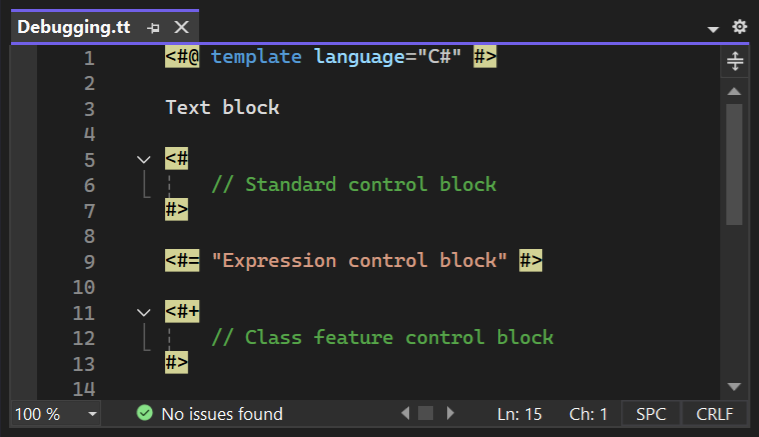

T4 Language for Visual Studio
=============================

   

Adds basic language support for .tt files.

The latest version is available on the [Visual Studio Marketplace](https://marketplace.visualstudio.com/items?itemName=bricelam.T4Language).

CI builds are available on the [Open VSIX Gallery](https://www.vsixgallery.com/extension/97edd510-988c-473f-9858-ddd5223eab1d). Install [this extension](https://marketplace.visualstudio.com/items?itemName=MadsKristensen.VSIXGallery-nightlybuilds) to get automatic updates.

Screenshots
-----------

Snippets
--------

The following code snippets are available.

Shortcut  | Code
--------- | -----------
assembly  | `<#@ assembly name="" #>`
import    | `<#@ import namespace="" #>`
include   | `<#@ include file="" #>`
parameter | `<#@ parameter name="MyParameter" type="System.String" #>`

Options
-------

You can customize the colors under **Tools > Options > Environment > Fonts and Colors**.

Display item      | Default (Light)
----------------- | ---------------
T4 Argument       | Red
T4 Argument Value | Blue
T4 Delimiter      | Yellow (background)
T4 Directive      | Maroon
T4 Operator (=)   | Blue

See also
--------

[Code Generation using T4 Text Templates](https://docs.microsoft.com/visualstudio/modeling/design-time-code-generation-by-using-t4-text-templates)
